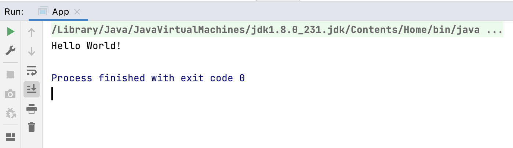
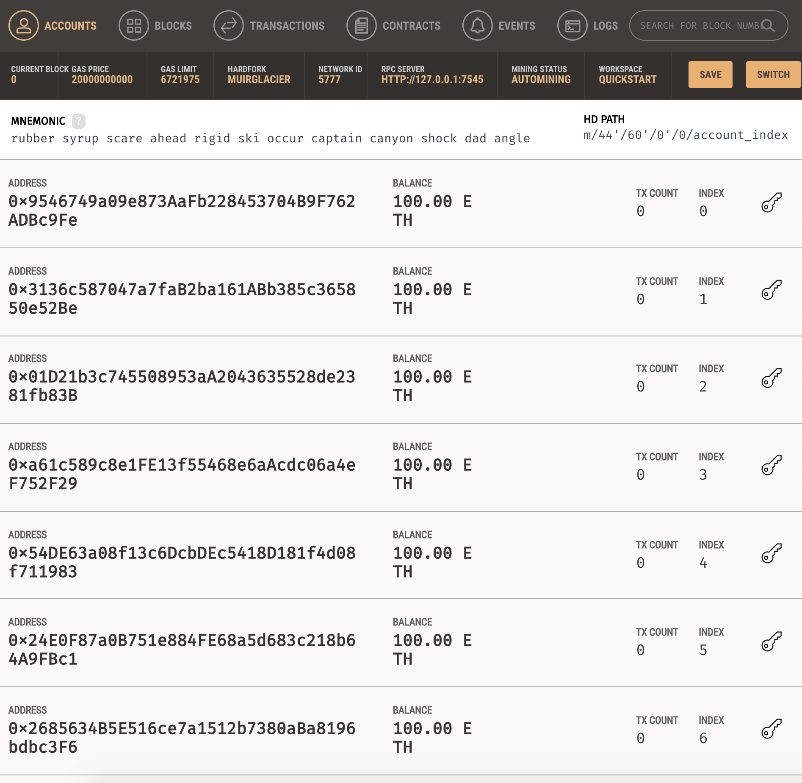
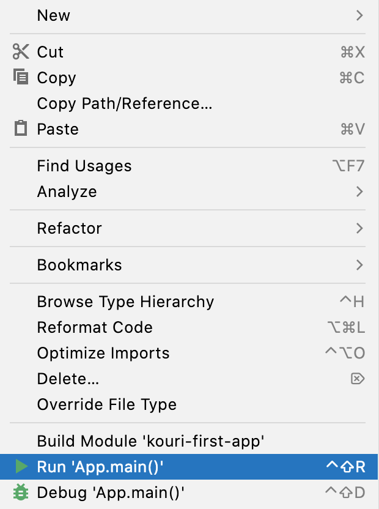

# Kouri
## Getting Started

Create a blank maven project

```
mvn archetype:generate -DgroupId=com.mycompany.app \
 -DartifactId=kouri-first-app -DarchetypeArtifactId=maven-archetype-quickstart -DarchetypeVersion=1.4 -DinteractiveMode=false
```
Test the project by running the app created.



Add following Maven dependency

```xml
  <dependency>
        <groupId>org.web3j</groupId>
        <artifactId>core</artifactId>
        <version>4.3.0</version>
  </dependency>
```


Change Compiler version to `1.8`
```xml
<properties>
    <project.build.sourceEncoding>UTF-8</project.build.sourceEncoding>
    <maven.compiler.source>1.8</maven.compiler.source>
    <maven.compiler.target>1.8</maven.compiler.target>
</properties>
```
Add the following code

```java
package com.mycompany.app;

import java.io.IOException;
import org.web3j.protocol.Web3j;
import org.web3j.protocol.http.HttpService;
import org.web3j.protocol.core.methods.response.EthBlockNumber;
import org.web3j.protocol.core.methods.response.EthGasPrice;
import org.web3j.protocol.core.methods.response.Web3ClientVersion;
/**
 * https://kauri.io/#communities/Java%20Ethereum/connecting-to-an-ethereum-client-with-java-eclips/
 *
 */
public class App
{
    public static void main( String[] args )
    {
        System.out.println("Connecting to Ethereum ...");
        Web3j web3 = Web3j.build(new HttpService("http://localhost:7545"));
        System.out.println("Successfuly connected to Ethereum");

        try {
            // web3_clientVersion returns the current client version.
            Web3ClientVersion clientVersion = web3.web3ClientVersion().send();

            // eth_blockNumber returns the number of most recent block.
            EthBlockNumber blockNumber = web3.ethBlockNumber().send();

            // eth_gasPrice, returns the current price per gas in wei.
            EthGasPrice gasPrice = web3.ethGasPrice().send();

            // Print result
            System.out.println("Client version: " + clientVersion.getWeb3ClientVersion());
            System.out.println("Block number: " + blockNumber.getBlockNumber());
            System.out.println("Gas price: " + gasPrice.getGasPrice());

        } catch (IOException ex) {
            throw new RuntimeException("Error whilst sending json-rpc requests", ex);
        }
    }
}
```

Start a Local Ganache Servier: 
refer to [Ganache websiite](https://trufflesuite.com/ganache/?utm_source=devportal) for more details.

Run the app, right click



Output will show the connection status, client version block number gas price.
```
Connecting to Ethereum ...
Successfuly connected to Ethereum
Client version: EthereumJS TestRPC/v2.13.1/ethereum-js
Block number: 0
Gas price: 20000000000

Process finished with exit code 0
```


